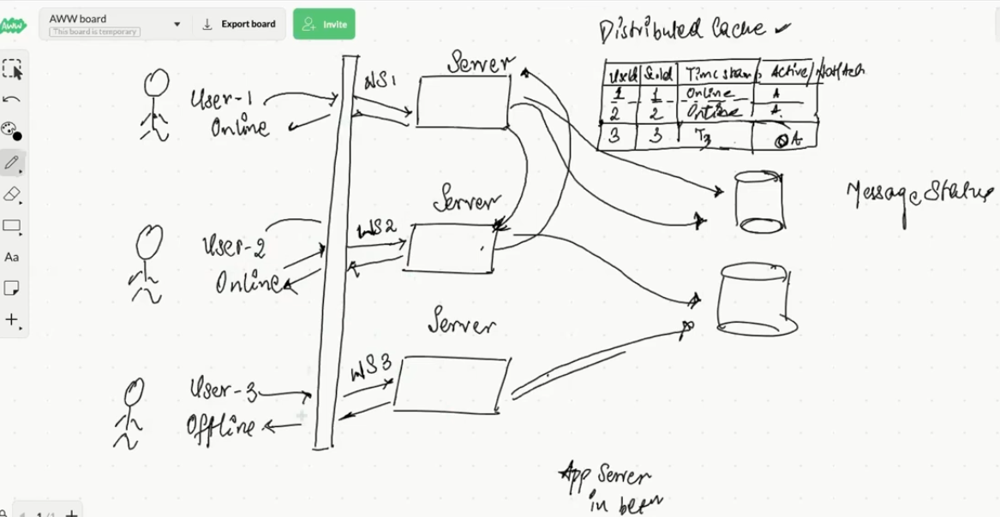

# FR
1. One to one chat messaging
2. Group chat messaging
3. check the status of user or (last seen time)
4. check status of message (SENT/DELIVERED/SEEN)
5. Fetch previous messages
## Optional
6. Delete the messages on the chat (Delete for yourself, everyone)
7. Share media

# NFR
- High Availability
- High Consistency
    - Trade off consistency for availability -> EventualConsistency
- Low Latency -> Almost real time experience when messages are sent
- Reliability
  - Messages should be encrypted
  - Retrieve previous messages/chats

# Estimations
## Assumptions
Total: 50M
DAU: 10M 
Messages sent by use to others in single day = 500
Message size = 200bytes (2 bytes per character)
### Optional
1 media per DAU -> 10 request for media file

## QPS
- Read:Write = 1:1
- 10M * 500 per day 
  - = 5 * 10^10 / 10^5
  - = 5 * 10^5 bytes
  - = 500000 bytes ~= 5MB per sec Read
  - = 500000 bytes ~= 5MB per sec Write
  - Media -> 1000M * 10 = 10000 QPS for reads & seconds
## Capacity Planning (Next 1 year)
Messages = 10M * 500 * 365 * 300 bytes =  
Media = (10M * 1MB * 365) = 

# Detailed Design
## HighLevelDesign

## APIs
#### GET
/chat HTTP/1.1
##### Request
###### Headers
    Host: example.com
    Upgrade: websocket          # Required: Indicates the upgrade to WebSocket
    Connection: Upgrade         # Required: Signals the connection upgrade
    Sec-WebSocket-Key: dGhlIHNhbXBsZSBub25jZQ==  # Required: Random 16-byte base64-encoded key
    Sec-WebSocket-Version: 13   # Required: WebSocket protocol version (13 is standard)
    Origin: https://example.com # Optional: Origin of the client (security check)
    Sec-WebSocket-Protocol: chat, superchat      # Optional: Sub-protocols the client supports
    Sec-WebSocket-Extensions: permessage-deflate # Optional: Extensions (e.g., compression)
#### Response
##### Headers
    HTTP/1.1 101 Switching Protocols
    Upgrade: websocket
    Connection: Upgrade
    Sec-WebSocket-Accept: HSmrc0sMlYUkAGmm5OPpG2HaGWk=****

send
receive
updatestatus
checkLatestStatusOfMessage

#### POST 
/api/otp
##### Response 201
/api/auth/login
Response 200, 401, 500 {
    credentials: <JWS_Token>
}

## DB
### Schema
chats
-----
id uuid (PK)
type (one to one / many to many / admin to many)

chat_members
------------
chat_id (FK chats.id)
account_id (FK account.id)
UK (chat_id account_id)

messages
--------
id uuid (PK)
chat_id (FK chats.id) (PartitionKey)
msg text
status (SENT/DELIVERED/SEEN)
createdAt not null default now() (Sort Key)
client_sequence_number int not null

groups
------
id uuid (PK)
chat_id (FK chats.id) (PartitionKey) (UK)
name varchar(128)
desc text

# Bottlenecks
## Websockets
1. avoids recreation connection agaon & again
2. stateful connection
3. uses hearbeat mechanism 
4. ttl: 
5. a connection can be upgraded via a load balancer to WebSocket, but you need to ensure that:
   - The load balancer supports WebSocket connections and is properly configured.
   - Session persistence is enabled if you're using multiple backend servers.
   - Both the client and server are properly configured to handle WebSocket connections.