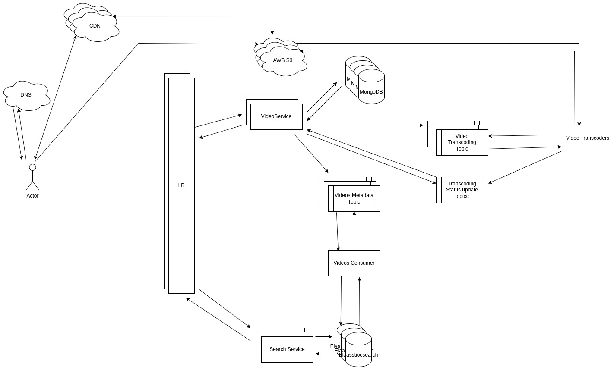

# FR
1. Upload
2. Watch

# NFR
- Reliability (Video should not be corrupted and should be durable)
- Availability
- Eventually consistent
- Low Latency

# Capacity Estimations
DAU: 1B

## Read::Write: 100:1
Each user watching: 5 videos per day
Total users watching video per day: 1B * 5 = 5B
Total videos uploaded per day: 5B/100 = 50M

## Transcoding Workers: 
50M/10^5 = 500 videos transcoding per sec 
Amount of time to transcode 1GB video = 60 sec
= 500 * 60 = **30K workers**

## Storage:
1year
Blob: 50M * 1GB * 365 = 1PB per day * 365 = 365PB
Metadata: ((50M * 1kb) / 2) * 365 = 500MB = 182GB

Top 5% get top 90% views

video loading **1MB chunks** 

## Network
TCP with HTTP streaming (HLS for Live streaming, (Manifest file, + video chunks), )
Watching: 1PB per day / 10^5sec  = 10GB per sec
Uploading: 10GB per sec / 100 = 10MB per sec 

# APIs
upload(title, desc, {length, size}, account_uuid): { video_uuid, uploadSignedUrl }
/videoplayback?uuid=
Content-Type: video/webm

# Tables
videos
------
uuid (16bytes)
title (text 128 bytes)
desc (text 256bytes)
length (16bytes)
status (Uploaded, Encding completed, public)

# Others
Rate Limiting for upload
Recommendations (user watch history, likes, favorite categories)
Centralized logging
CI/CD
service discovery

Shard mongodb on video_uuid and use consistent hashing

# Flow
